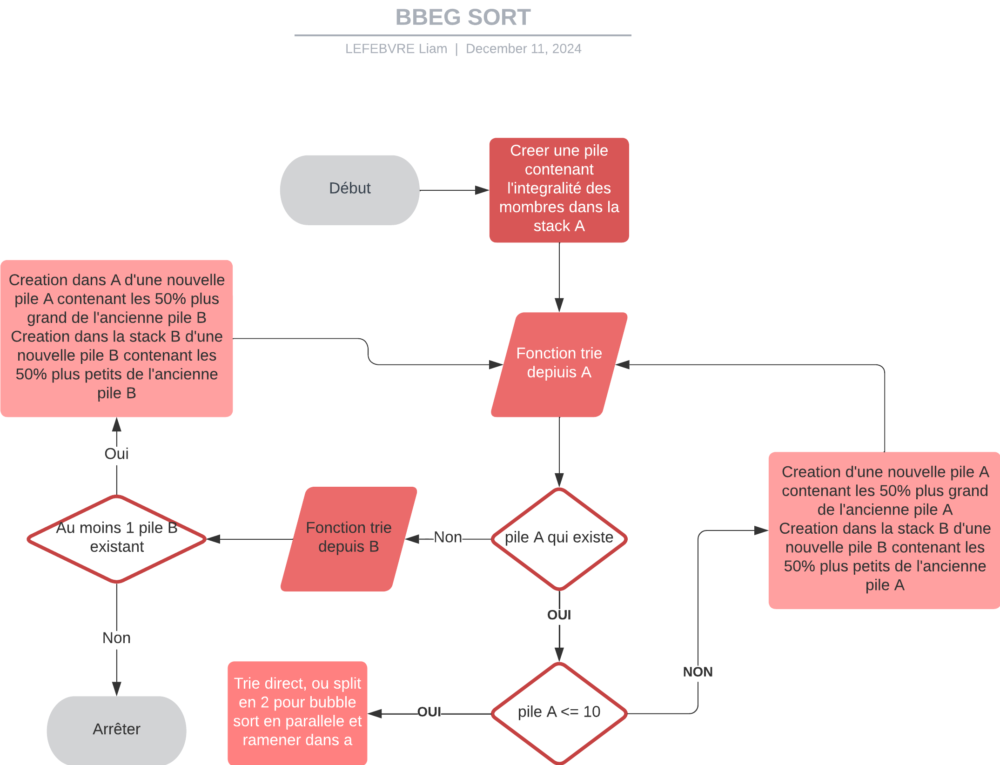

# push_swap

Because a sorting algorithm isn't enough.

## Generalities

Push_swap is a project of 42 school. The objective is to sort a given list of numbers with restricted actions, and with the least amount of actions possible (a maximum of 700 actions for 100 numbers and 5500 actions to sort 500 numbers). You can do your own research if you want more information about the subject.

## My algorithms

I have multiple algorithms depending on the number of elements.

#### 100 numbers

To sort 100 numbers, my algorithm is like an improved version of insertion sort.

First, the algorithm will create multiple packs of numbers (in the case of 100 numbers, it will be 5 packs of 20 numbers). Then, the algorithm will apply a real sort, each time putting the largest number back in stack A (or the second largest before putting the largest and just swapping them when they are both in stack A).

And that's it, your entire stack is sorted.

#### 500 numbers

I don't know if this algorithm already exists or not, I haven't found it online.

Here is a quick schema of how it works:



## Installation

To install the project, clone the repository and run the following commands:

```sh
git clone https://github.com/Liammmmmmmm/42-push_swap.git
cd push_swap
make
```

## Usage

To run the program, use the following command:

```sh
./push_swap [list of numbers]
```

Example:

```sh
./push_swap 3 2 5 1 4
```

You can also force the usage of a specific sorting algoritm with :
```sh
# Force use of radix sort
make radix

# Force use of bubble sort (absolutly useless)
make bubble

# Force use of the simplified version of my first own sort algorithm (ideal algorithm for 100 numbers)
make mylittle

# Force use of my first own sort algorithm (ideal algorithm for 150-400 numbers)
make mysort

# Force use of the sort I imagined with a friend. Ideal for 500 numbers and more (This one is more efficient than a radix on 5000 numbers)
make bbeg
```

If you want to "benchmark" the algorithm you can use complexity (push swap tester on github).
If you want to visualize the algoritms, you can download push swap visualizer on github.

## Contact

For questions or feedback, please contact `lilefebv@student.42lyon.fr`.